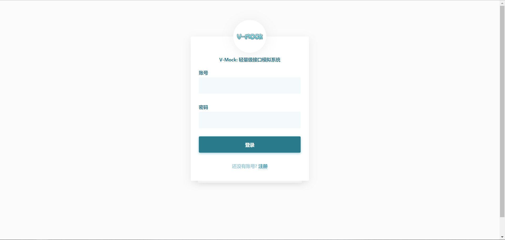
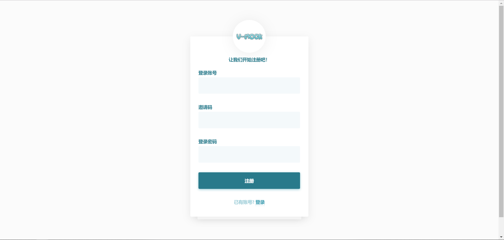
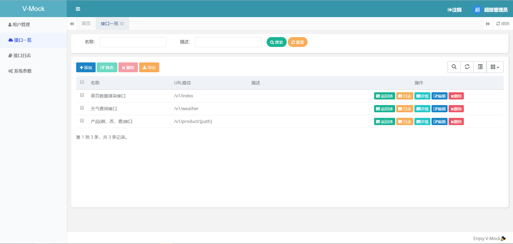
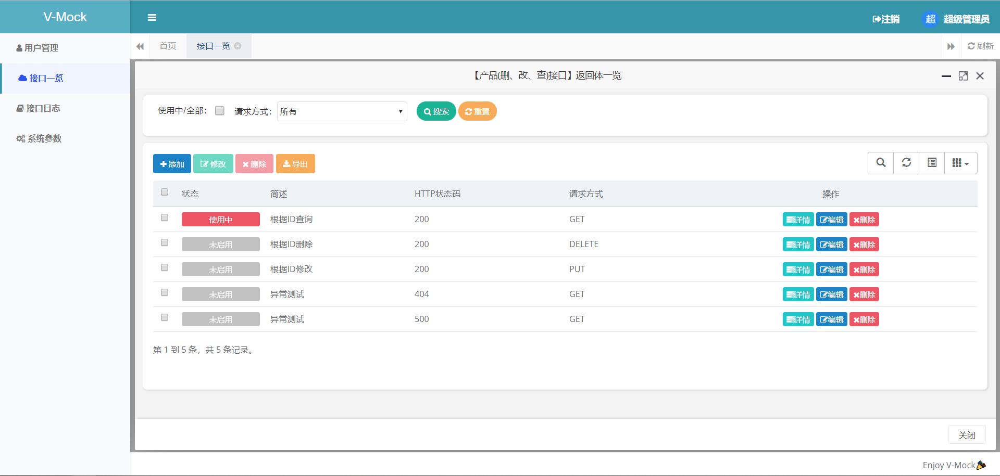
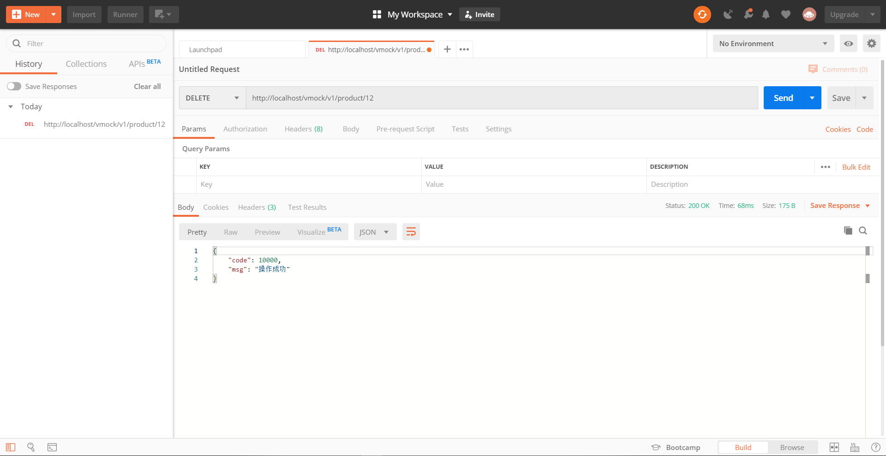
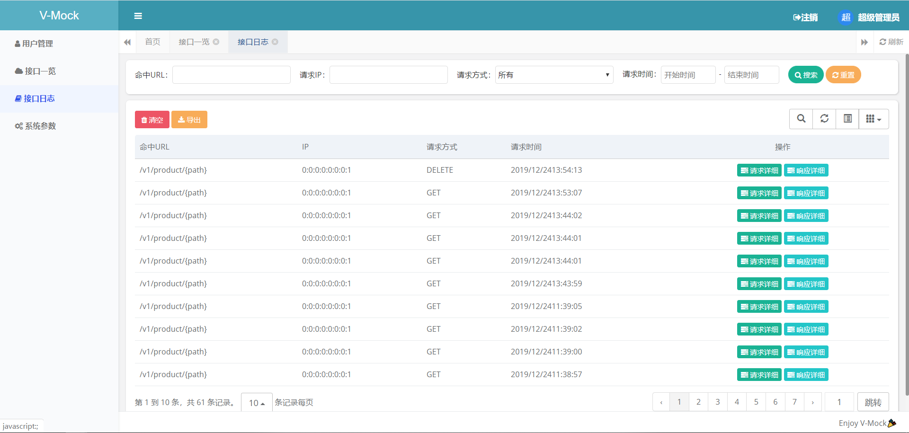
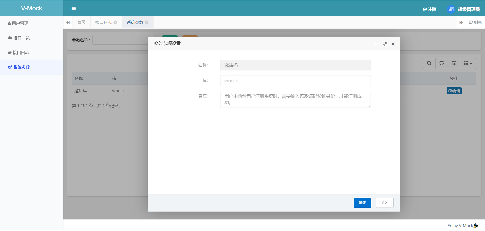
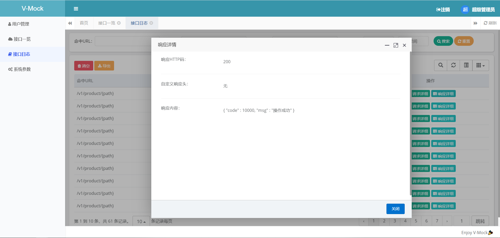

# V-Mock

简单，轻量级，秒部署的接口模拟系统。

### V-Mock是什么

V-Mock是一个小巧的接口响应模拟系统，安装完成后，录入你要模拟的接口URL，及该URL返回的JSON，XML或者其他格式的返回数据，即可开始调用。

### 功能

* 支持任何请求类型，包括Path传参请求。
* 支持自定义的响应Header，http status code，以及返回体。(但是不建议乱写http码，比如有的浏览器接收到返回状态是789，可能请求就挂了)
* 提供每次调用成功的详细【请求体详细】以及【响应体详细】的日志，请求头..参数..Header..Cookies都能找到。
* 支持创建多种返回格式，一键切换。
ps： 暂时不支持根据请求参数的逻辑切换返回格式，仅可以在后台一键切换返回体，但这样的好处是方便开发人员测试。

### 什么场景你可能会用V-Mock？

* 前后端对接，后端暂未开发完成。
* 第三方对接，但对方无法提供测试环境。
* 要求Mock功能对代码“**0**”污染
* 公司数据安全严格/Mock数据无法托管到第三方/内网开发等情况。
* 觉得同类高端软件功能太多用不上/不易部署等😀

### 如何安装

如果只是使用，我们只需要JRE即可，无需任何其他软件。 

默认80端口 可以追加 --server.port=xxx 自己指定 


```
java -jar v-mock.jar
```
即可使用  
## 如何使用

安装完成后，根据自己的ip以及指定的端口，访问V-Mock后台界面。
使用管理员账号：vmock/vmock123 登录系统

登录成功后，即可在【接口一览】模块，配置需要Mock的URL了。

##### 注意
所有被Mock的URL所属Context Path默认是 /vmock
则如果配置了/v1/test，请求是由http(s)://ip:prot/vmock/v1/test接收
也就是说如果调用者的系统，是将根路径写在配置文件中的话，需要把/vmock加上即可  

※不要配置前后矛盾的URL，如配置了/v1/test/{path}又配置了/v1/test/{test}※

##### 多用户
管理员也可以修改系统参数中的【邀请码】，则普通用户即可通过邀请码自行注册系统。

##### 权限
权限设计非常简洁：
* 管理员：能多看见【系统参数】【用户管理】两个模块。
* 普通用户：可以使用【接口一览】和【接口日志】模块。
* 未登录：可以调用/vmock下，系统中配置好的Mock接口。

## 部分截图展示
登录 注册
<div align="center">
    
    
</div>
接口一览 返回体一览
<div align="center">
    
    
</div>
增加返回体 Postman调用结果
<div align="center">
    
    
</div>
日志一览 修改邀请码
<div align="center">
    
    
</div>
请求详细 响应详细
<div align="center">
    
    
</div>

## 作者

* [vt](https://blog.iyuhao.site) gentle715@163.com
